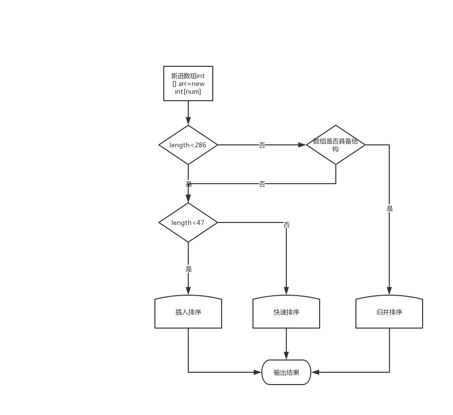

# Array.sourt() 排序原理

Arrays.sort并不是单一的排序，而是插入排序，快速排序，归并排序三种排序的组合

其中是否具备结构根据 实际逻辑是分组排序，每降序为一个组，像1,7,6,5,3,4。7到3是降序，为一个组，然后把降序的一组排成升序：1,3,5,6,7,4
每遇到这样一个降序组，++count，当count大于MAX_RUN_COUNT（67），被判断为这个数组不具备结构（也就是这数据时而升时而降），然后送给之前的sort(里面的快速排序)的方法（The array is not highly structured,use Quicksort instead of merge sort.）。

如果count少于MAX_RUN_COUNT（67）的，说明这个数组还有点结构，就继续往下走下面的归并排序

